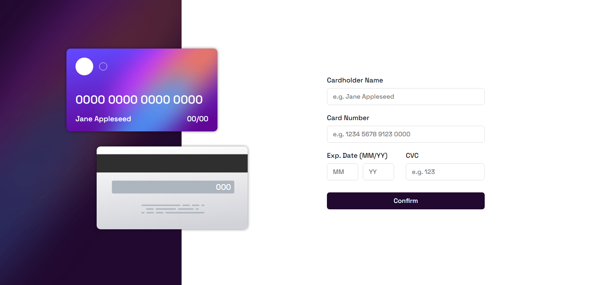
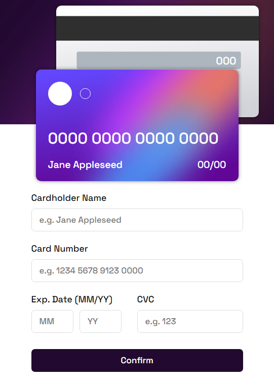

# Frontend Mentor - Interactive card details form solution

This is a solution to the [Interactive card details form challenge on Frontend Mentor](https://www.frontendmentor.io/challenges/interactive-card-details-form-XpS8cKZDWw). Frontend Mentor challenges help you improve your coding skills by building realistic projects. 

## Table of contents

- [Overview](#overview)
  - [The challenge](#the-challenge)
  - [Screenshot](#screenshot)
  - [Links](#links)
- [My process](#my-process)
  - [Built with](#built-with)
  - [What I learned](#what-i-learned)
  - [Continued development](#continued-development)
  - [Useful resources](#useful-resources)
- [Author](#author)
- [Acknowledgments](#acknowledgments)

**Note: Delete this note and update the table of contents based on what sections you keep.**

## Overview

### The challenge

Users should be able to:

- Fill in the form and see the card details update in real-time
- Receive error messages when the form is submitted if:
  - Any input field is empty
  - The card number, expiry date, or CVC fields are in the wrong format
- View the optimal layout depending on their device's screen size
- See hover, active, and focus states for interactive elements on the page

### Screenshot





### Links

[Solution URL](https://github.com/Austinet/interactiveCard.git)
[Live site URL](https://austinet.github.io/interactiveCard/)

## My process

### Built with

- Semantic HTML5 markup
- CSS custom properties
- Flexbox
- Desktop-first workflow
- Vanilla JavaScript
- Google font

### What I learned

I learnt and implemented how to use the input event listener to update the DOM in real time. I also learnt how to validate input using Regular expressions.


```html
<h1>Some HTML code I'm proud of</h1>
```

```js
//oninput event listeners to update card 
cardForm.cardHolder.addEventListener("input", ()=>{
  holder.innerHTML = cardForm.cardHolder.value;
})
```


### Continued development

I'll keep on working on projects to gain more experience in order to be industry ready.


### Useful resources

- [Google](https://www.google.com) 
- [w3schools](https://www.w3schools.com) -


## Author

- Website - [Udhe Austine Ogaga](https://Austinet.github.io/portfolio)
- Frontend Mentor - [@austinet](https://www.frontendmentor.io/profile/austinet)
- Twitter - [@austineudhe](https://www.twitter.com/austineudhe)


## Acknowledgments

I'll like to acknowledge the Frontend mentor team for helping with coding challenges and guide. 
